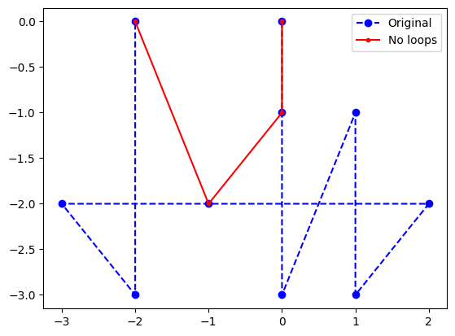

# loopicide
A simple algorithm for removing all spatial loops from an ordered point array without using a graph-based approach like Dijkstra's algorithm.

# installation
```bash
git clone https://github.com/jacksonjacobs1/loopicide.git
cd loopicide
pip install .
```

See demos/demo.ipynb for usage.





