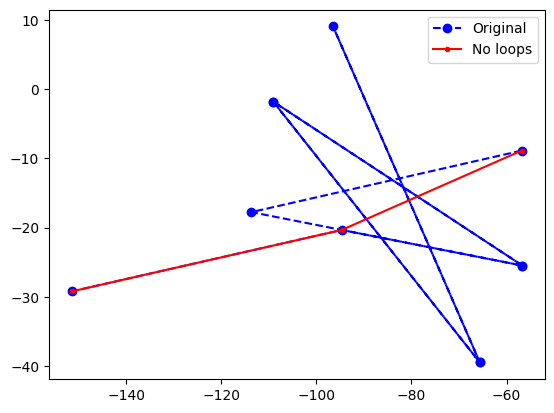

# loopicide
A simple algorithm for removing all spatial loops from an ordered point array without using a graph-based approach like Dijkstra's algorithm.

Use demos/demo.ipynb to reproduce the following results:

